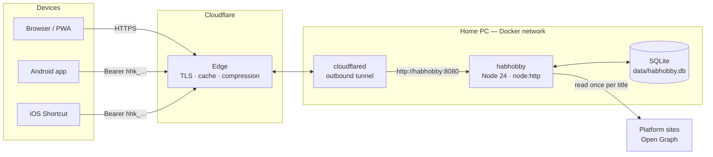
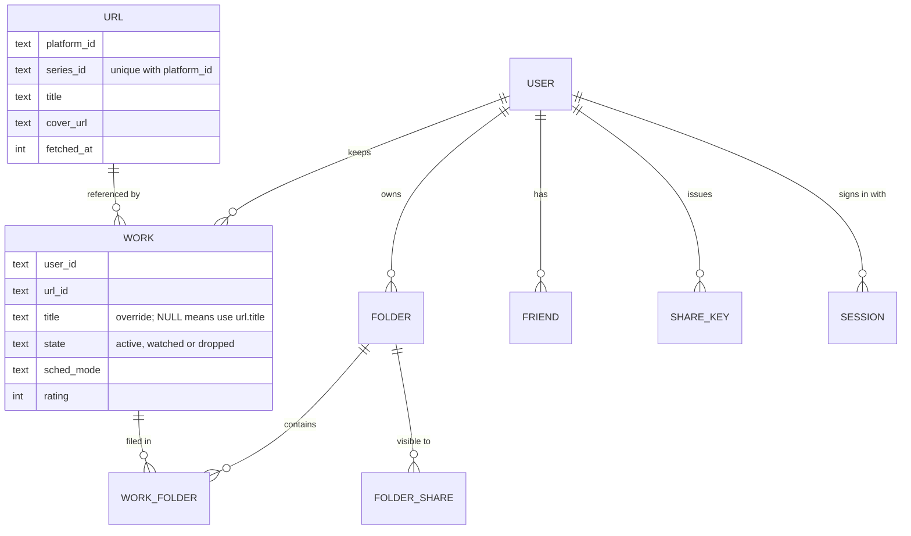

# HabHobby

**One list for everything you watch and read — webtoons, dramas, films, anime — no matter which platform it lives on.**

Live at [kim5ing.cloud](https://kim5ing.cloud) · 95 commits · 2026-09-01 → 2026-09-11 · zero runtime dependencies

---

## 1. Topic

### The problem
A typical viewer follows series across a dozen services: Naver Webtoon, Kakao Page,
Netflix, Laftel, TVING, Ridi, blogs… Each app remembers where you left off, but only
inside itself. There is no single place that answers *"what am I following, and
what's out today?"*

### The idea
HabHobby is a **launcher, not a tracker.** It does not record "episode 16" — every
platform already does that better. It gathers the scattered lists into one screen,
and a tap sends you **back to the platform**, where its own "continue watching"
takes over.

### Design principles
| | Principle | What it means in practice |
| --- | --- | --- |
| **P1** | **Register with the share button** | No official APIs exist. Adding a title is one tap on "Share → HabHobby". No account linking, no session scraping — only the public link preview (Open Graph). |
| **P2** | **Link to the series, not the episode** | The series ID is extracted from the shared URL and rebuilt into the series page URL, which is more stable than episode URLs. |
| **P3** | **Delegate progress to the platform** | Sending the user to the series page lets the platform show its own resume point. |
| **P4** | **Uneven coverage is a premise, not a bug** | Every feature must work when information is missing: unknown URLs group by domain, titles without a schedule appear as "no schedule". |

---

## 2. What was built

### Core experience
- **Calendar** — weekly and monthly views of what updates when, plus side lists for
  upcoming releases and titles without a date.
- **Pages** — one horizontal rail per platform, ordered by what you opened last; a
  platform index; merge or split domains into your own groupings.
- **Folders** — organise titles your way, with an icon or a name as the folder's face.
- **Archive & Trash** — finished and dropped titles. The archive has its own folders
  and sort tabs; both support long-press multi-select and bulk actions.
- **Search** across everything; **themes** with contrast-checked accent colours;
  open titles in the platform app or on the web.

### Adding titles — three entry points, one rule
- **Web share target** (installed PWA) → `POST /share`
- **Android app** — a Trusted Web Activity plus a native share activity
- **iOS Shortcuts** — calling the same endpoint with a device key

All three go through one server function (`intakeShared`). A device **share key**
(`hhk_…`) can only add URLs; it cannot read or change anything else.

When a URL arrives, the server identifies the platform and series, reads the page
**once**, and stores it in a shared `url` table. The next person who adds the same
title reuses that row — no second request to the site. Dead links (404/410, redirected
to the home page, generic landing pages) are rejected before saving.

### Social
- **Friends** via invite links.
- **Folder sharing, decided when the folder is created:**
  - **Regular folder** — friends can *clone* it (take a copy) and/or *mirror* it
    (follow your changes live), with a single audience setting.
  - **Shared folder** — invited friends add and remove titles together.

  The kind cannot be changed afterwards, so a shared folder can never quietly
  become a public one.
- Per-viewer personalisation: rename or re-icon a mirrored folder without affecting
  the owner.

### Accounts
- ID/password login and a guest mode. OAuth (Kakao, Naver, Google) is implemented
  with stored state and verifier, and is currently switched off in production.

### Operations
- Self-hosted on a home PC in Docker, published through a Cloudflare Tunnel.
- A background job refreshes expiring CDN cover URLs (every 6 h, entries older than
  3 days, 40 per run, 1.5 s apart). Covers are **linked, never copied**.
- 12 numbered schema migrations. All 22 existing backups were restored and booted as a
  test; 21 start cleanly.

---

## 3. Tech stack

| Layer | Choice | Why |
| --- | --- | --- |
| Runtime | **Node.js 24**, running `.ts` directly (type stripping) | No build step, no transpiler |
| HTTP | `node:http` | One process serves the API, static files and share intake |
| Database | **SQLite** via built-in `node:sqlite` (WAL mode) | One file, no database server, fast at this scale |
| Crypto | `node:crypto` — `scrypt`, `randomBytes`, `timingSafeEqual` | Password hashing and tokens without libraries |
| Front end | **Vanilla JavaScript** SPA (~7,100 lines), hand-written CSS, inline SVG icons | No framework, no bundler |
| PWA | Web App Manifest with `share_target`, a small service worker | Installable, appears in the OS share sheet |
| Android | Java, Trusted Web Activity (`androidbrowserhelper`), native `ACTION_SEND` activity | Native share entry, web UI |
| Deploy | **Docker** (`node:24-alpine`, non-root user) + **Cloudflare Tunnel** | No inbound ports, home IP never published |
| Dependencies | **None** in `package.json` | Nothing to install, nothing to audit |

Code size: server ~5,000 lines of TypeScript, client ~9,000 lines of JS/CSS/HTML,
Android ~280 lines of Java.

---

## 4. Architecture

### Deployment and request path


- The tunnel connects **outward** to Cloudflare; the router has no port forwarding.
- The app port is bound to `127.0.0.1` only. The tunnel reaches the app over the
  Docker network, so nothing on the local network can bypass Cloudflare.

### Inside a request
```
request
  → security headers   CSP (script hash), nosniff, frame deny, no-referrer, X-Robots-Tag
  → auth routes        login, OAuth callback
  → /share             session cookie OR device share key → intakeShared()
  → /api/*             session required (401 otherwise); every query scoped by user_id
  → static files       content-hashed URLs (?v=sha256), ETag / 304, in-memory cache
  → SPA fallback       index.html
```

### Data model
The central decision is separating **what a title is** (shared by everyone) from
**how a person keeps it** (private to them).



- A title is shown as `COALESCE(work.title, url.title)`: editing your copy never
  changes anyone else's.
- A partial unique index (`WHERE state <> 'dropped'`) allows **one row per person per
  title** outside the trash: a title is either in your list or in your archive, never
  both. The trash may hold several, because dropping the same title twice can be two
  separate decisions.
- Schema changes run as numbered migrations (`once(n)`), written as frozen SQL.

### Measured (2026-09-02, single PC)
| Scenario | Result |
| --- | --- |
| `GET /api/state`, heavy user | ~975 req/s |
| Writes | ~773 req/s |
| Static files | ~15,500 req/s |
| 1,000 concurrent connections | 0 errors |
| `app.js` over the wire | 340 KB → 106 KB, compressed at the edge |

---

## 5. Troubleshooting

43 incidents are written up in [`troubleshooting/`](troubleshooting/README.md), each as
**Symptom → Cause → Fix (commit) → Prevention**. Highlights:

| Area | Incident | Lesson |
| --- | --- | --- |
| Security | **Invite codes were mostly a timestamp.** 8 of 10 characters were `Date.now()`, and accepting a code added a friend without approval. | ID generators are not secret generators — use `randomBytes`. |
| Security | **Port 8080 was open to the whole LAN.** `"8080:8080"` binds `0.0.0.0`; the comment above it said *localhost*. | When a comment and a config disagree, test the config. |
| Security | **The CSP silently disabled `` fallbacks.** Script hashes do not cover inline event handlers. | After adding a CSP, search for `on*=` attributes. |
| Data | **Backups older than schema 7 would not boot.** A migration sat out of order, and its "refuse if not empty" guard still advanced the version. | Migrations run in numeric order and never return early to refuse — migrate or throw. 21 of 22 backups now restore. |
| Data | **`cp` backups missed recent writes.** In WAL mode the newest data lives in the `-wal` file. | Back up with `VACUUM INTO`. |
| Operations | **A redeploy took the site down (HTTP 530).** The tunnel token was dead, hidden by a connection opened before the tunnel was recreated. | A live connection can mask a dead credential — verify before recreating. |
| Operations | **A test server locked the production database**, causing a two-minute outage. | Every test instance gets its own `DATA_DIR`. |
| UI | **A CSS comment closed one line early** and swallowed the next rule. | CSS fails silently — confirm the rule exists before re-fixing the layout. |
| Clients | **Android share did nothing.** The activity was flagged to finish immediately but had to wait 1–3 s for the server. | Match activity flags to the activity's real lifetime. |
| Tooling | **Shell heredocs collapsed `\\` into `\`**, producing regexes that matched nothing. | When a result looks too good or too bad, suspect the tool first. |

**Still open:** backups share a disk with the live database; Cloudflare's managed
`robots.txt` overrides the repository's; uploaded cover URLs are guessable.
