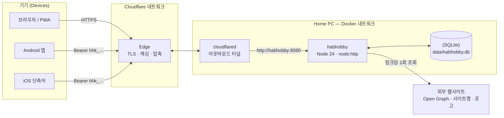
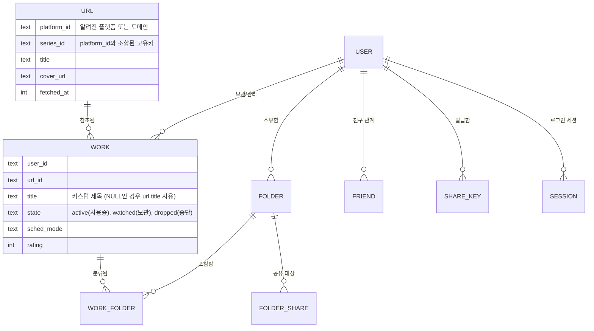

# HabHobby (합하비)

**어떤 사이트에서든 원터치로 링크를 저장하고, 한 곳에 모아보며, 친구들과 함께 사용하세요.**

라이브 서비스: [kim5ing.cloud](https://kim5ing.cloud) · 95 커밋 · 2026-09-01 → 2026-09-11 · 런타임 의존성 0개 (Zero Runtime Dependencies)

---

## 1. 주제 (Topic)

### 문제점 (The problem)
다시 찾아보고 싶은 콘텐츠들은 여러 곳에 산재해 있습니다. 웹툰은 특정 앱에, 시리즈는 넷플릭스에, 블로그 글이나 친구가 채팅방에 던져준 페이지까지. 브라우저 북마크는 기기 한 대와 사용자 한 명에게 갇혀 있고, 메신저로 보낸 링크는 대화 속에 묻혀 잊혀집니다. 각 앱은 오직 앱 내부에서만 자체 목록을 기억할 뿐입니다.

### 아이디어 (The idea)
HabHobby는 **링크를 위한 런처(Launcher)**입니다. 어떤 앱이나 사이트에서든 페이지를 공유하면, 해당 사이트 고유의 제목, 커버 이미지, 이름, 로고가 담긴 카드로 전환됩니다. 카드는 사이트별로 그룹화되고, 폴더에 분류되며, 정기적으로 업데이트되는 콘텐츠는 달력(캘린더)에 배치됩니다. 탭 한 번으로 원래 앱이나 웹상의 **원본 페이지로 바로 이동**할 수 있습니다.

처음에는 사람들이 즐겨보는 연재물(웹툰, 드라마, 애니메이션) 관리에서 시작되었으며, 여전히 이 분야에 가장 깊이 특화되어 있습니다. 하지만 미디어에만 국한되지 않고 모든 웹 콘텐츠에 적용 가능합니다.

### 차별점 (What makes it different)
- **모든 사이트 지원:** 11개 주요 플랫폼(네이버 웹툰, 카카오페이지, 넷플릭스, 라프텔, 티빙, 리디, 네이버 블로그, 티스토리 등)은 시리즈 단위로 정밀 분석되어 인지됩니다. **그 외 모든 사이트도 완벽 작동합니다:** 별도의 설정이나 작업 없이 도메인을 자동으로 인식하여 사이트 이름과 로고를 가져옵니다.
- **공유를 위한 설계:** 링크는 개인의 폐쇄적인 북마크 더미가 아니라, 사람들과 **함께 활용하는 자산**이 됩니다. 폴더를 공유하여 친구들이 복사하거나, 내가 업데이트할 때 실시간으로 따라오게 하거나, 함께 폴더를 구축할 수 있습니다.
- **원터치 추가:** Android, iOS 공유 시트 또는 설치된 웹 앱(PWA)에서 단 한 번의 탭으로 추가 가능합니다.
- **원본 사이트가 정보의 주체:** 진행 상황, 콘텐츠, 이미지는 항상 원본 사이트에 남습니다. HabHobby는 해당 페이지로 링크만 연결할 뿐, 콘텐츠를 복사하거나 수집하지 않습니다.

### 활용 사례 (What people can do with it)
- 여러 플랫폼에 흩어진 웹툰, 드라마, 소설의 연재 일정을 하나의 달력에서 추적.
- 여러 블로그 및 아티클 링크를 담은 잃어버리지 않는 읽기 목록(Reading List) 관리.
- 친구들과 **함께** 스터디 자료, 맛집 리스트, 여행 계획 폴더 구축.
- 친구의 추천 리스트를 실시간 연동 폴더로 구독하여 업데이트 확인.

### 디자인 원칙 (Design principles)
| | 원칙 | 실제 적용 방식 |
| --- | --- | --- |
| **P1** | **공유 버튼으로 추가** | "공유 → HabHobby" 탭 한 번으로 추가 완료. 계정 연동이나 로그인 장벽 뒤의 스크래핑 없이, 페이지가 링크 미리보기(Open Graph)용으로 공개한 정보만 활용. |
| **P2** | **고정(유효한) 페이지 지향** | 알려진 플랫폼의 경우 공유된 URL에서 시리즈 ID를 추출하여 회차별 URL이 아닌 지속 유지되는 시리즈 대표 페이지로 재구성. 일반 페이지는 수신된 그대로 유지. |
| **P3** | **원본 사이트가 단 하나의 진실(Source of Truth)** | 진행률, 내용, 이미지는 원래 위치에 유지. 사용자를 원본 페이지로 돌려보내 사이트 자체의 "이어보기" 기능을 활용하도록 유도. |
| **P4** | **비대칭적 정보는 버그가 아닌 전제조건** | 사이트마다 제공하는 정보가 다르며 시간 지남에 따라 변함. 가능한 모든 정보를 유연하게 활용: 미인식 사이트는 도메인별로 그룹화하고, 일정이 없는 항목도 정상 표시. |

---

## 2. 구축된 기능 (What was built)

### 링크 추가 — 모든 사이트, 3가지 진입점, 단 하나의 규칙
- **Web Share Target** (설치된 PWA) → `POST /share`
- **Android 앱** — Trusted Web Activity(TWA) 및 네이티브 공유 액티비티 제공
- **iOS 단축어** — 기기 키(Device Key)를 사용하여 동일한 엔드포인트 호출
- 링크 입력 없이 직접 손으로 항목 작성도 가능.

모든 공유 경로는 단 하나의 서버 함수(`intakeShared`)를 거치므로 어느 기기에서 요청하든 동일하게 처리됩니다. 기기별 **공유 키**(`hhk_…`)는 오직 링크 추가 권한만 가지며, 다른 데이터를 읽거나 수정할 수 없습니다.

링크가 도착하면 서버는 해당 사이트가 알려진 플랫폼/시리즈인지 단순 도메인인지 판별하고, 페이지를 **딱 한 번만 조회**한 뒤 공유 `url` 테이블에 저장합니다. 동일한 페이지를 저장하는 다음 사용자는 이 데이터베이스 행을 재사용하므로 대상 사이트에 중복 요청을 보내지 않습니다. 깨진 링크(404/410 오류, 메인 페이지 리다이렉트, 범용 랜딩 페이지, 존재하지 않는 도메인)는 저장 전에 자동으로 거부됩니다.

### 친구와 공유하기
- **친구 관계:** 초대 링크를 통해 친구를 추가합니다.
- **친구 폴더 탐색:** 친구의 폴더를 살펴보고 개별 링크 또는 전체 선택 항목을 자신의 목록으로 가져올 수 있습니다.
- **폴더 생성 시 공유 방식 결정:** 나중에 설정이 흐지부지 변경되지 않도록 생성 시점에 지정:
  - **일반 폴더 (Regular Folder)** — 친구들이 **복사(Clone)**하거나 **미러링(Mirror, 작성자의 변경사항을 실시간 반영)**할 수 있음. 공개 범위 설정 가능 (전체 친구 또는 선택한 친구).
  - **공유 폴더 (Shared Folder)** — 초대된 친구들이 **함께** 링크를 추가하고 삭제함.
  
  공유 폴더가 유저 모르게 전체 공개 폴더로 전환되는 일은 불가능합니다.
- **공유 항목의 개인화 뷰:** 미러링 중인 폴더의 이름이나 아이콘을 소유자의 데이터에 영향을 주지 않고 나만의 스타일로 변경 가능. 내 목록에서 링크 제목을 수정해도 다른 사용자에게 영향을 주지 않음.

### 정리 및 관리 (Organising)
- **페이지 (Pages)** — 사이트별 가로 스크롤 레이아웃. 최근 열어본 순으로 정렬되며, 사이트 인덱스 제공 및 도메인을 커스텀 그룹으로 병합/분리 가능.
- **폴더 (Folders)** — 나만의 그룹화 기능. 아이콘이나 이름을 폴더 대표 이미지로 지정.
- **달력 (Calendar)** — 정기 연재 항목을 위한 주간 및 월간 뷰 제공. 일정 미정 항목 및 예정 항목 목록 포함.
- **보관함 & 휴지통 (Archive & Trash)** — 감상 완료 및 중단(Drop) 항목 관리. 보관함 전용 폴더 및 정렬 탭 제공. 롱프레스(길게 누르기) 다중 선택 및 일괄 작업 지원.
- **검색 & 테마** — 전체 항목 대상 검색, 대비 검증을 마친 강조 색상 테마 지원, 링크를 앱 또는 웹으로 열기 선택 가능.

### 계정 (Accounts)
- ID/비밀번호 로그인 및 게스트 모드 지원. OAuth(카카오, 네이버, 구글)는 상태 저장 및 검증 기능까지 구현되어 있으나 현재 프로덕션 환경에서는 비활성화됨.

### 운영 및 인프라 (Operations)
- 홈 PC의 Docker 환경에서 셀프 호스팅되며 Cloudflare Tunnel을 통해 외부로 안전하게 서비스됨.
- 만료되는 CDN 이미지 URL을 주기적으로 갱신하는 백그라운드 작업 실행 (6시간마다, 3일 이상 된 항목 대상, 1회 실행당 40개, 1.5초 간격). 이미지는 **링크만 걸릴 뿐 절대로 서버에 복사되지 않음**.
- 12개의 번호가 매겨진 데이터베이스 스키마 마이그레이션 적용. 기존 22개 백업 전체를 복원 및 부팅 테스트 완료 (21개 정상 부팅 확인).

---

## 3. 기술 스택 (Tech stack)

| 계층 (Layer) | 선택한 기술 | 선택 이유 |
| --- | --- | --- |
| Runtime | **Node.js 24** (`.ts` 파일 직접 실행, Type Stripping 활용) | 빌드 단계 없음, 트랜스파일러 불필요 |
| HTTP | `node:http` (내장 모듈) | 단일 프로세스에서 API, 정적 파일, 공유 수신을 모두 처리 |
| Database | **SQLite** (내장 `node:sqlite` 사용, WAL 모드) | 단일 파일 관리, DB 서버 불필요, 현재 규모에서 압도적 성능 |
| Crypto | `node:crypto` (`scrypt`, `randomBytes`, `timingSafeEqual`) | 외부 라이브러리 없이 암호 해싱 및 토큰 보안 처리 |
| Front end | **Vanilla JavaScript** SPA (~7,100줄), 수작업 CSS, 인라인 SVG 아이콘 | 프레임워크 미사용, 번들러 미사용 |
| PWA | `share_target`이 포함된 Web App Manifest, 경량 Service Worker | 앱 설치 가능, OS 네이티브 공유 시트에 표시됨 |
| Android | Java, Trusted Web Activity (`androidbrowserhelper`), 네이티브 `ACTION_SEND` 액티비티 | 네이티브 공유 진입점 + 웹 UI 조합 |
| Deploy | **Docker** (`node:24-alpine`, 비-root 사용자) + **Cloudflare Tunnel** | 인바운드 포트 개방 없음, 홈 IP 외부 노출 완벽 차단 |
| Dependencies | `package.json` 기준 **0개** | 설치할 모듈 없음, 보안 감사(Audit) 위험 요소 없음 |

코드 규모: 서버 TypeScript 약 5,000줄, 클라이언트 JS/CSS/HTML 약 9,000줄, Android Java 약 280줄.

---

## 4. 아키텍처 (Architecture)

### 배포 및 요청 경로 (Deployment and request path)


- 터널이 Cloudflare를 향해 **외부 방향(Outward)**으로 연결되므로 라우터 포트 포워딩이 필요 없습니다.
- 앱 포트는 오직 `127.0.0.1`에만 바인딩됩니다. 터널은 Docker 내부 네트워크를 통해 앱에 접근하므로 로컬 네트워크의 그 어떤 장치도 Cloudflare를 우회할 수 없습니다.

### 요청 처리 흐름 (Inside a request)
```
요청(request) 수신
  → 보안 헤더 적용      CSP (스크립트 해시), nosniff, frame deny, no-referrer, X-Robots-Tag
  → 인증 라우트         로그인, OAuth 콜백
  → /share 엔드포인트   세션 쿠키 또는 기기 공유 키 검증 → intakeShared() 실행
  → /api/* 엔드포인트   세션 필수 (미인증 시 401); 모든 쿼리는 user_id 범위로 제한
  → 정적 파일           콘텐츠 해시 URL (?v=sha256), ETag / 304, 인메모리 캐시 처리
  → SPA 폴백            index.html 반환
```

### 데이터 모델 (Data model)
핵심 설계는 **'링크 그 자체의 정보'**(모두가 공유)와 **'개인이 링크를 보관하는 방식'**(개인 전용)을 엄격히 분리한 것입니다. 이 분리 구조 덕분에 공유 비용이 매우 저렴해집니다. 친구들이 동일한 페이지를 저장하거나 미러링할 때 모두 단 하나의 `url` 행을 참조하게 됩니다.



- 항목 제목은 `COALESCE(work.title, url.title)` 형태로 표시되므로, 내가 내 복사본의 제목을 수정해도 타인의 데이터는 변하지 않습니다.
- 부분 유니크 인덱스(`WHERE state <> 'dropped'`)를 통해 휴지통 외부에서는 **1인당 1개 링크에 대해 단 하나의 행만 허용**됩니다. 즉, 항목은 목록에 있거나 보관함에만 존재하며 양쪽에 동시에 존재할 수 없습니다. 반면 휴지통은 동일한 항목을 두 번 버리는 결정이 별개일 수 있으므로 여러 개를 담을 수 있습니다.
- 스키마 변경사항은 동결된 SQL 문으로 작성된 번호 매기기 마이그레이션(`once(n)`)으로 안전하게 실행됩니다.

### 성능 측정 결과 (2026-09-02, 단일 PC 기준)
| 시나리오 | 측정 결과 |
| --- | --- |
| `GET /api/state` (헤비 유저 데이터 기준) | 초당 약 975회 요청 처리 (~975 req/s) |
| 쓰기(Write) 작업 | 초당 약 773회 요청 처리 (~773 req/s) |
| 정적 파일 전송 | 초당 약 15,500회 요청 처리 (~15,500 req/s) |
| 1,000개 동시 접속 요청 | 오류 0건 (0 errors) |
| 전송 시 `app.js` 크기 | 340 KB → 106 KB (Edge 엣지 단에서 압축 전송) |

---

## 5. 트러블슈팅 및 문제 해결 (Troubleshooting)

이 프로젝트 개발 과정에서 발생한 43건의 인시던트가 [`troubleshooting/`](troubleshooting/README.md)에 **증상(Symptom) → 원인(Cause) → 수정 내용(Fix) → 예방책(Prevention)** 구조로 기록되어 있습니다. 주요 하이라이트:

| 분야 | 인시던트 이슈 | 배운 점 (Lesson) |
| --- | --- | --- |
| 보안 | **초대 코드가 사실상 타임스탬프였음.** 10자 중 8자가 `Date.now()`로 생성되었으며, 코드를 수락하면 승인 절차 없이 친구가 추가됨. | ID 생성기는 보안 비밀번호 생성기가 아니다 — 반드시 `randomBytes`를 사용할 것. |
| 보안 | **8080 포트가 전체 LAN에 개방되어 있었음.** `"8080:8080"` 설정은 `0.0.0.0`에 바인딩됨 (주석에는 *localhost*라고 적혀 있었음). | 주석과 실제 설정이 일치하지 않을 때는 항상 실제 설정을 테스트하고 검증할 것. |
| 보안 | **CSP로 인해 `` 렌더링이 작동하지 않음.** 스크립트 해시(Script Hash)는 인라인 이벤트 핸들러를 포함하지 않음. | CSP 정책을 추가한 후에는 반드시 코드 내 `on*=` 속성을 검색하고 점검할 것. |
| 데이터 | **스키마 7 이전의 오래된 백업이 부팅되지 않음.** 마이그레이션 순서가 꼬여 있었고 "비어있지 않으면 거부" 가드가 작동하면서 버전만 올려버림. | 마이그레이션은 항상 숫자 순서대로 실행되어야 하며 중간에 거부하여 조기 리턴하면 안 됨. 실패 시 거부 대신 에러(throw) 발생시킬 것. 현재 22개 중 21개 백업 정상 복원 완료. |
| 데이터 | **`cp` 명령어로 복사한 백업에서 최근 쓰기 데이터가 누락됨.** WAL 모드에서는 최신 데이터가 `-wal` 파일에 남음. | WAL 모드의 DB 백업은 반드시 `VACUUM INTO` 명령을 사용할 것. |
| 운영 | **재배포 과정에서 사이트 전체가 다운됨 (HTTP 530).** 터널 토큰이 만료되었으나, 터널 재생성 전에 열려 있던 기존 연결 때문에 문제를 감지하지 못함. | 살아있는 연결이 만료된 자격 증명을 가릴 수 있음 — 터널 재생성 전 자격 증명을 사전 검증할 것. |
| 운영 | **테스트 서버가 프로덕션 데이터베이스를 잠가버려** 2분간 서비스 장애 발생. | 모든 테스트 인스턴스는 반드시 독립된 자체 `DATA_DIR`을 할당받아야 함. |
| UI | **CSS 주석 닫기가 한 줄 일찍 적용되어** 다음 스타일 규칙을 삼켜버림. | CSS는 오류를 조용히 무시하므로, 레이아웃을 다시 수정하기 전에 스타일 규칙이 제대로 생성되었는지 확인할 것. |
| 클라이언트 | **Android 공유 기능이 반응하지 않음.** 액티비티가 즉시 종료(`finish`)되도록 플래그가 설정되었으나 서버 응답을 위해 1~3초 대기해야 했음. | 액티비티 플래그를 실제 액티비티 생명주기에 맞게 설정할 것. |
| 도구 | **Shell Heredoc이 `\\`를 `\`로 축소시켜** 아무것도 매칭되지 않는 정규식이 생성됨. | 결과가 너무 완벽하거나 너무 엉망일 때는 코드보다 도구/환경을 먼저 의심해볼 것. |

**현재 미해결 과제:** 백업 파일이 라이브 DB와 동일한 디스크를 공유함; Cloudflare 관리형 `robots.txt`가 저장소의 파일보다 우선 적용됨; 업로드된 이미지 URL을 추측할 수 있는 구조임.
