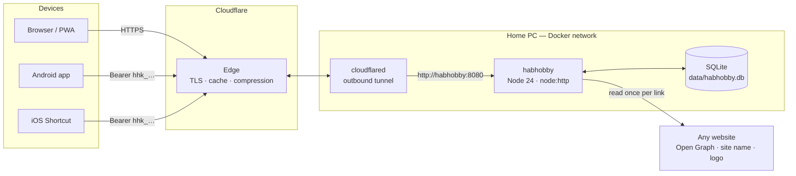
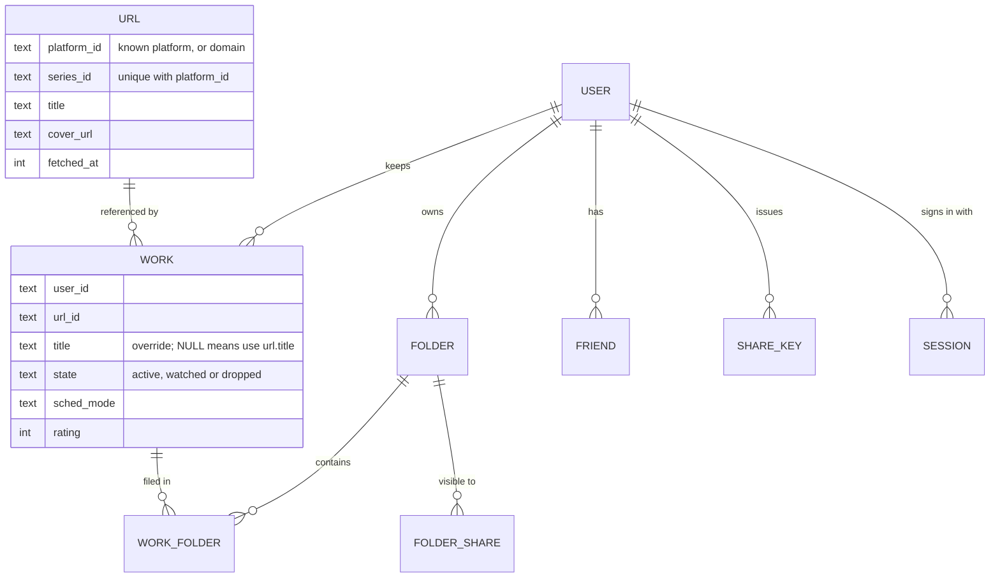

# HabHobby

**Save a link from any site with one tap, keep it in one place, and use it together with friends.**

Live at [kim5ing.cloud](https://kim5ing.cloud) · 95 commits · 2026-09-01 → 2026-09-11 · zero runtime dependencies

---

## 1. Topic

### The problem
The things we want to come back to are scattered. A webtoon on one app, a series on
Netflix, a blog post, a page a friend dropped in a chat. Browser bookmarks stay on
one device and one person. Links sent in messages scroll away. Each app remembers
its own list — only inside itself.

### The idea
HabHobby is a **launcher for links.** Share a page from any app or site, and it
becomes a card with that site's own title, cover, name and logo. Cards are grouped by
site, filed into folders, and — for things that update on a schedule — placed on a
calendar. A tap sends you **back to the original**, in its app or on the web.

It started with series people follow (webtoons, dramas, anime), and that is still
where it goes deepest. But nothing about it is limited to media.

### What makes it different
- **Works with any site.** Eleven platforms are understood at the series level
  (Naver Webtoon, Kakao Page, Netflix, Laftel, TVING, Ridi, Naver Blog, Tistory, …).
  **Every other site works too**: it is recognised by its domain automatically, with
  the site's own name and logo — no setup, no list to maintain.
- **Built to be shared.** Links become something you use *with* people, not a
  private bookmark pile. Share a folder so friends can copy it, follow it as you
  update it, or build it with you.
- **One tap to add.** From the share sheet on Android, iOS, or the installed web app.
- **The original stays the source.** Progress, content and images stay on the
  original site. HabHobby links to them; it never copies them.

### What people can do with it
- Follow webtoons, dramas and novels across different platforms on one calendar.
- Keep a reading list of blog posts and articles from anywhere.
- Build a folder of study links, restaurants or trip ideas **together** with friends.
- Follow a friend's recommendations as a live folder that updates when they do.

### Design principles
| | Principle | What it means in practice |
| --- | --- | --- |
| **P1** | **Add with the share button** | Adding is one tap on "Share → HabHobby". No account linking, no scraping behind logins — only what the page publishes for link previews (Open Graph). |
| **P2** | **Point at the stable page** | For known platforms, the series ID is pulled from the shared URL and rebuilt into the series page, which outlives episode URLs. Any other page is kept as it is. |
| **P3** | **The original site is the source of truth** | Progress, content and images stay where they are. Sending you back to the page lets the site show its own "continue" point. |
| **P4** | **Uneven information is a premise, not a bug** | Sites expose different things, and that changes over time. Every feature works with whatever is available: unknown sites group by domain, items without a schedule still appear. |

---

## 2. What was built

### Adding links — any site, three entry points, one rule
- **Web share target** (installed PWA) → `POST /share`
- **Android app** — a Trusted Web Activity plus a native share activity
- **iOS Shortcuts** — calling the same endpoint with a device key
- Or type an item in by hand, with no link at all.

All three share paths go through one server function (`intakeShared`), so a link is
handled the same way whichever device it came from. A device **share key** (`hhk_…`)
can only add links; it cannot read or change anything else.

When a link arrives, the server works out which site it belongs to — a known
platform and series, or simply its domain — reads the page **once**, and stores it in
a shared `url` table. The next person who saves the same page reuses that row, so the
site is not asked twice. Dead links (404/410, redirects to the home page, generic
landing pages, domains that don't exist) are rejected before saving.

### Sharing with friends
- **Friends** join through invite links.
- **See a friend's folders** and take individual links, or a whole selection, into
  your own list.
- **Folder sharing is decided when the folder is created**, so it can't drift later:
  - **Regular folder** — friends can **clone** it (take a copy that is theirs) and/or
    **mirror** it (see your changes as you make them), with one audience setting:
    all friends or chosen friends.
  - **Shared folder** — invited friends add and remove links **together**.

  A shared folder can never quietly become a public one.
- **Personal view of shared things.** Rename or re-icon a folder you mirror without
  changing it for the owner. Editing a link's title in your list never changes anyone
  else's.

### Organising
- **Pages** — one horizontal rail per site, ordered by what you opened last; a site
  index; merge or split domains into your own groupings.
- **Folders** — your own groupings, with an icon or a name as the folder's face.
- **Calendar** — weekly and monthly views for things that update on a schedule, plus
  lists of upcoming items and items without a date.
- **Archive & Trash** — finished and dropped items. The archive has its own folders
  and sort tabs; both support long-press multi-select and bulk actions.
- **Search** across everything; **themes** with contrast-checked accent colours; open
  links in the site's app or on the web.

### Accounts
- ID/password login and a guest mode. OAuth (Kakao, Naver, Google) is implemented
  with stored state and verifier, and is currently switched off in production.

### Operations
- Self-hosted on a home PC in Docker, published through a Cloudflare Tunnel.
- A background job refreshes expiring CDN image URLs (every 6 h, entries older than
  3 days, 40 per run, 1.5 s apart). Images are **linked, never copied**.
- 12 numbered schema migrations. All 22 existing backups were restored and booted as a
  test; 21 start cleanly.

---

## 3. Tech stack

| Layer | Choice | Why |
| --- | --- | --- |
| Runtime | **Node.js 24**, running `.ts` directly (type stripping) | No build step, no transpiler |
| HTTP | `node:http` | One process serves the API, static files and share intake |
| Database | **SQLite** via built-in `node:sqlite` (WAL mode) | One file, no database server, fast at this scale |
| Crypto | `node:crypto` — `scrypt`, `randomBytes`, `timingSafeEqual` | Password hashing and tokens without libraries |
| Front end | **Vanilla JavaScript** SPA (~7,100 lines), hand-written CSS, inline SVG icons | No framework, no bundler |
| PWA | Web App Manifest with `share_target`, a small service worker | Installable, appears in the OS share sheet |
| Android | Java, Trusted Web Activity (`androidbrowserhelper`), native `ACTION_SEND` activity | Native share entry, web UI |
| Deploy | **Docker** (`node:24-alpine`, non-root user) + **Cloudflare Tunnel** | No inbound ports, home IP never published |
| Dependencies | **None** in `package.json` | Nothing to install, nothing to audit |

Code size: server ~5,000 lines of TypeScript, client ~9,000 lines of JS/CSS/HTML,
Android ~280 lines of Java.

---

## 4. Architecture

### Deployment and request path


- The tunnel connects **outward** to Cloudflare; the router has no port forwarding.
- The app port is bound to `127.0.0.1` only. The tunnel reaches the app over the
  Docker network, so nothing on the local network can bypass Cloudflare.

### Inside a request
```
request
  → security headers   CSP (script hash), nosniff, frame deny, no-referrer, X-Robots-Tag
  → auth routes        login, OAuth callback
  → /share             session cookie OR device share key → intakeShared()
  → /api/*             session required (401 otherwise); every query scoped by user_id
  → static files       content-hashed URLs (?v=sha256), ETag / 304, in-memory cache
  → SPA fallback       index.html
```

### Data model
The central decision is separating **what a link is** (shared by everyone) from
**how a person keeps it** (private to them). That split is also what makes sharing
cheap: when friends save or mirror the same page, they all point at one `url` row.



- An item is shown as `COALESCE(work.title, url.title)`: editing your copy never
  changes anyone else's.
- A partial unique index (`WHERE state <> 'dropped'`) allows **one row per person per
  link** outside the trash: an item is either in your list or in your archive, never
  both. The trash may hold several, because dropping the same thing twice can be two
  separate decisions.
- Schema changes run as numbered migrations (`once(n)`), written as frozen SQL.

### Measured (2026-09-02, single PC)
| Scenario | Result |
| --- | --- |
| `GET /api/state`, heavy user | ~975 req/s |
| Writes | ~773 req/s |
| Static files | ~15,500 req/s |
| 1,000 concurrent connections | 0 errors |
| `app.js` over the wire | 340 KB → 106 KB, compressed at the edge |

---

## 5. Troubleshooting

43 incidents are written up in [`troubleshooting/`](troubleshooting/README.md), each as
**Symptom → Cause → Fix (commit) → Prevention**. Highlights:

| Area | Incident | Lesson |
| --- | --- | --- |
| Security | **Invite codes were mostly a timestamp.** 8 of 10 characters were `Date.now()`, and accepting a code added a friend without approval. | ID generators are not secret generators — use `randomBytes`. |
| Security | **Port 8080 was open to the whole LAN.** `"8080:8080"` binds `0.0.0.0`; the comment above it said *localhost*. | When a comment and a config disagree, test the config. |
| Security | **The CSP silently disabled `` fallbacks.** Script hashes do not cover inline event handlers. | After adding a CSP, search for `on*=` attributes. |
| Data | **Backups older than schema 7 would not boot.** A migration sat out of order, and its "refuse if not empty" guard still advanced the version. | Migrations run in numeric order and never return early to refuse — migrate or throw. 21 of 22 backups now restore. |
| Data | **`cp` backups missed recent writes.** In WAL mode the newest data lives in the `-wal` file. | Back up with `VACUUM INTO`. |
| Operations | **A redeploy took the site down (HTTP 530).** The tunnel token was dead, hidden by a connection opened before the tunnel was recreated. | A live connection can mask a dead credential — verify before recreating. |
| Operations | **A test server locked the production database**, causing a two-minute outage. | Every test instance gets its own `DATA_DIR`. |
| UI | **A CSS comment closed one line early** and swallowed the next rule. | CSS fails silently — confirm the rule exists before re-fixing the layout. |
| Clients | **Android share did nothing.** The activity was flagged to finish immediately but had to wait 1–3 s for the server. | Match activity flags to the activity's real lifetime. |
| Tooling | **Shell heredocs collapsed `\\` into `\`**, producing regexes that matched nothing. | When a result looks too good or too bad, suspect the tool first. |

**Still open:** backups share a disk with the live database; Cloudflare's managed
`robots.txt` overrides the repository's; uploaded image URLs are guessable.
